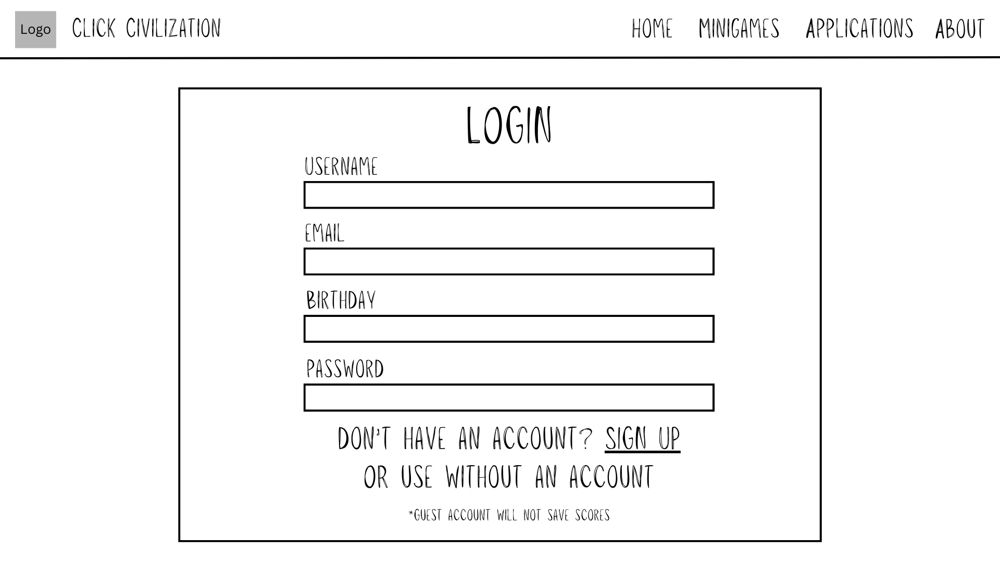

### UPDATE PLAN:

Firstly, we plan to add our last two originally planned applications/minigames. These would be the target clicking minigame and the CPS test application. Other things that would hopefully be added in this update are background music, customizable settings, and a better design overall.

Next, to incorporate the use of persistent data, we plan to add user accounts. We will try to allow users to save their previous high scores in their games. If possible, it may also add leaderboards to the game. Here are some examples in JSON format:

Type of Data: User Account Login
Purpose: Allows for the creation of an account to save scores
Structure in JSON format:
```javascript
account {
    username: text-string,
    password: text-string,
    email: email-formatted-text-string,
}
```

Type of Data: User Scores
Purpose: Allows for the storing/saving of scores (Leaderboard)
Structure in JSON format:
```javascript
scores {
    CPS: number,
    RT: number,
    Clicker: number,
    TC: number,
}
```

Here is the wireframe for the account login:


A save button will be added in applications and minigames in order to save the average score. It would notify the user if the saved score is higher than the current score, in which case it would ask the user if they are certain they'd like to save their current score.


# 🖱️✨ Title: Click Civilization ✨🖱️

### Description:

Do you enjoy fidgeting with your mouse and clicking randomly on your screen? If so, this website will be an
enjoyable experience for you! Click Civilization is a website with fun, random, silly minigames and applications all
involving the extremely fun entertaning activity of clicking. This website will include a CPS (clicks per second) test, a reaction
time test, a mini idle clicking game (similar to games like cookie clicker), and other added minigames.

### Outline:


### Wireframe:


### Use of JavaScript:

JavaScript will be heavily used for the mini applications and minigames. An example of this would be for the 
reaction time test. In this mini application, we would need to use JavaScript in order to detect the click of the 
user then check how much time it took for them to click on the window. We would also need to randomize the time
it takes for the cue to click (The change of color) to display using the random function so as to not make the change predictable as 
it would defeat the entire purpose of the test. 

[Link to the Actual Website](https://rajveermadrid.github.io/WDProjMagnesiumLopingcoMadrid/public/index.html)